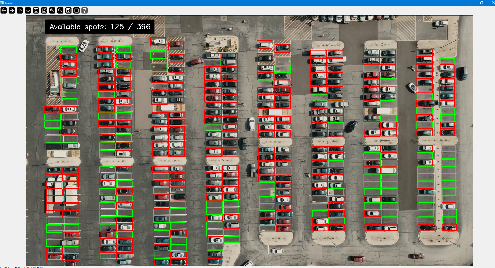

# parking_space_counter

To run the file

```
python -m sklearnex main.py
```

### **Optimization:**

1) Predict the parking spot after every 30 frames instead of every single frame:
Initially we performed the parking spot prediction/classifcation on every single frame. Since we know that parking a car takes roungly 5-10 seconds, we can perform a check on the status of the parking spot after few seconds instead of checking the status every second( every frame). Hence, to optimize the code we update the parking spot every 30 frames

2) Look only that those parking spots where something is going on instead of checking all parking spots
plot the histogram of frames and check for outliers. Here, outliers are those frames where the difference bettween previous frame and current frame is huge.
Once we have the outliers, we can check only those parking slots and update the status of the parking slot

### **Data**
Download the data [link](https://drive.google.com/drive/folders/1Q-idkb-SYzve60a5feqGe7Gk1dCO9spL)

### **Output**



